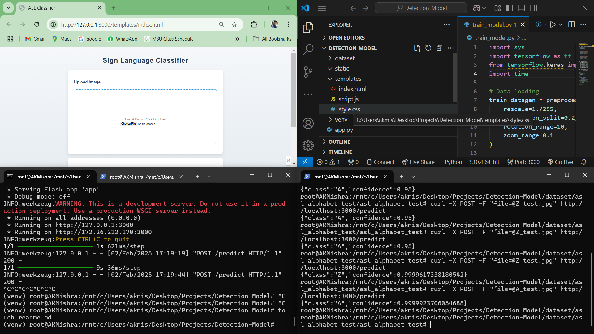
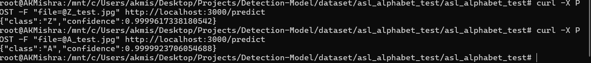
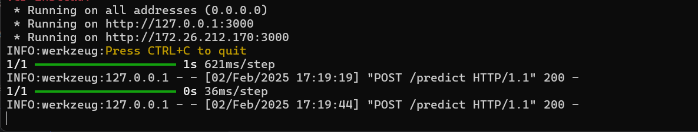
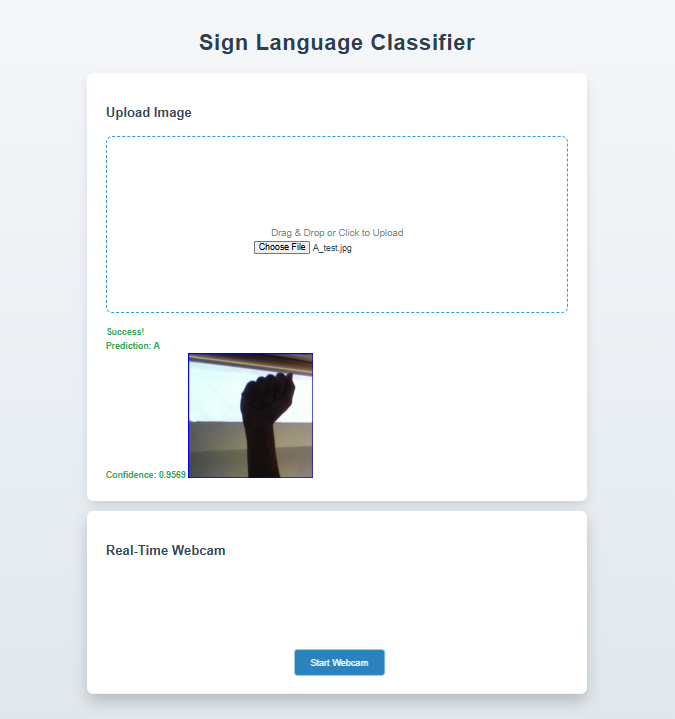

# Sign Language Classification System



<h5>An end-to-end solution for American Sign Language recognition using deep learning and web technologies.</h5>


## Table of Contents
- [Features](#features)
- [Screenshots](#screenshots)
- [Installation](#installation)
- [Dataset Setup](#dataset-setup)
- [Model Training](#model-training)
- [Running the Application](#running-the-application)
- [Usage](#usage)
- [Project Structure](#project-structure)
- [Troubleshooting](#troubleshooting)

## Features
- 🖼️ Image-based ASL alphabet classification (A-Z + space/del/nothing)
- 📸 Real-time webcam gesture recognition
- 🎨 Modern drag-and-drop interface
- 📊 Confidence percentage visualization
- 🚀 Flask-based REST API

## Screenshots
| Component | Preview |
|-----------|---------|
| **Terminal Success** |  |
| **Server Side** |  |
| **Front-end** |  |


## Installation

### 1. Clone Repository
```bash
git clone https://github.com/yourusername/sign-language-classifier.git
cd sign-language-classifier
```

### 2. Create Virtual Environment

#### Linux/MacOS
```bash
python3 -m venv venv
source venv/bin/activate
```

#### Windows
```bash
python -m venv venv
.venv\Scripts\activate
```

### 3. Install Dependencies
```bash
pip install -r requirements.txt
```

## Dataset Setup

### Dataset Details
- **Source**: Kaggle ASL Alphabet Dataset  
- **Total Classes**: 29 (A-Z + space, delete, nothing)  
- **Training Images**: 87,000+  
- **Resolution**: 200x200 pixels (resized to 64x64 for training)  

### Download Instructions

#### Using Kaggle API
```bash
kaggle datasets download -d grassknoted/asl-alphabet
unzip asl-alphabet.zip -d dataset/
```

#### Manual Download
1. Visit the [Kaggle dataset page](https://www.kaggle.com/grassknoted/asl-alphabet).
2. Download and extract to:
   ```
   dataset/asl_alphabet_train/asl_alphabet_train/
   ```

#### Folder Structure Verification
Ensure your dataset is structured as follows:
```
dataset/
└── asl_alphabet_train/
    └── asl_alphabet_train/
        ├── A/          # 3,000 images
        ├── B/          # 3,000 images
        ├── C/          # 3,000 images
        ...
        └── nothing/    # 3,000 images
```

## Model Training

### Architecture Summary

```python
Sequential([
    Conv2D(32, (3,3), activation='relu', input_shape=(64,64,3)),
    MaxPooling2D(2,2),
    Conv2D(64, (3,3), activation='relu'),
    MaxPooling2D(2,2),
    Conv2D(128, (3,3), activation='relu'),
    MaxPooling2D(2,2),
    Flatten(),
    Dense(512, activation='relu'),
    Dropout(0.5),
    Dense(29, activation='softmax')
])
```

### Training Parameters

| Parameter          | Value               |
|--------------------|---------------------|
| **Input Size**      | 64x64 pixels        |
| **Batch Size**      | 32                  |
| **Epochs**          | 10                  |
| **Validation Split**| 20%                 |
| **Optimizer**       | Adam                |
| **Loss Function**   | Categorical Crossentropy |

### Execution Command
To train the model, run the following:
```bash
python train_model.py
```

### Expected Output
You should see output similar to:
```bash
Epoch 1/10
2175/2175 [==============================] - 145s 66ms/step 
- loss: 1.2345 - accuracy: 0.6789 - val_loss: 0.9876 - val_accuracy: 0.7654

Epoch 2/10
2175/2175 [==============================] - 142s 65ms/step
- loss: 0.6543 - accuracy: 0.8765 - val_loss: 0.5432 - val_accuracy: 0.8765
...
```

Finally, run the following to start the application:
```bash
python app.py
```

## Running the Application
Once the model is trained, you can run the Flask application:
```bash
python app.py
```

The app will be hosted locally on your machine (typically on port 5000). You can access the front-end UI through the browser to interact with the sign language classifier.

## Usage
- Upload images of hand gestures to classify them.
- Use the webcam to capture real-time gestures and classify them.
- See the prediction results and confidence percentages in the UI.

## Project Structure
```
sign-language-classifier/
│
├── app.py              # Flask app for the web interface
├── train_model.py      # Model training script
├── requirements.txt    # Python dependencies
├── dataset/            # Dataset directory
│   └── asl_alphabet_train/ # ASL alphabet training images
├── src/                # Source files (images, icons, etc.)
├── templates/          # HTML templates for Flask app
└── static/             # Static assets (CSS, JS, etc.)
```

## Troubleshooting
- **Issue**: Error while training the model  
  **Solution**: Ensure that the dataset is correctly downloaded and structured as per the instructions above.

- **Issue**: Cannot access webcam in the app  
  **Solution**: Make sure your browser has permission to access the webcam and that the camera is not being used by any other application.


